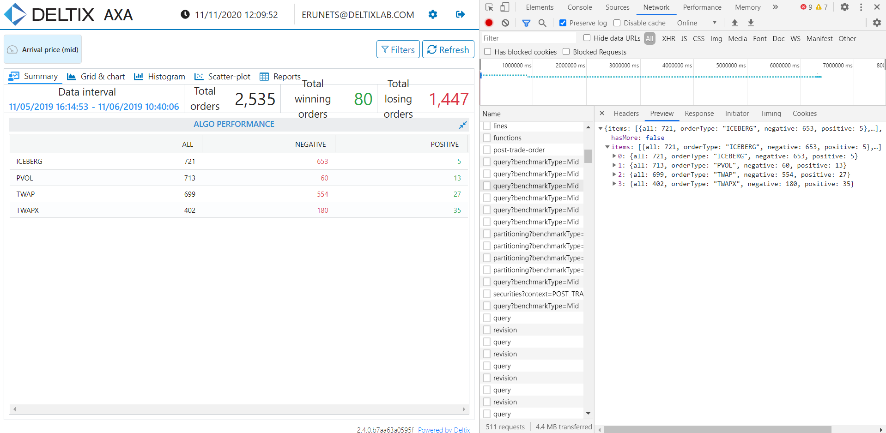

This repository contains some homework from my Epam course on automated testing [Link](https://www.it-academy.by/course/java-test-automation-engineer-by-epam/at1-qa-automation-with-java/).

## Calculator&TestsJUnit5

- Write a simple calculator with four basic operations in Java. 
- Test code by JUnit5.
- Get a report in Surefire reports. 

## SelenideOnliner

Implement 3 test cases using Selenide
1. open the catalog section, check the presence of the sections "Electronics", "Computers and networks", "Household appliances", "Construction and repair",
"Home and Garden","Auto and Moto","Beauty and Sports","For Children and Mothers","Work and Office","Food"
2.open the "Computers and Networks" section of the catalog. Make sure that a vertical list of section items appears and that at least
items "Laptops, computers, monitors", "Components", "Data storage", "Network equipment".
3. open the item "Accessories". Check that in the list of components that appears, all elements contain the name, quantity of goods and the minimum price.
4. All tests must be independent of each other.

##Cucumber

Website onliner.by testing using Selenide, JUnit4, Cucumber. 
  Scenarios:
1. open the main page of the site and hover over the menu Auto Flea Market. Check that a submenu has opened with a division into categories.
2. open the main page of the site, hover over the menu Apartments. Check that a submenu has appeared with division into subcategories.

##API Test

  Test Steps:
1. Open **Dev Tools** -> **Network**.
2. Select query and switch to **Preview**.
3. Check all, negative and positive values in **Network** match with values in **Algo performance**.  

  

Since the site is currently unavailable, it is possible only to see the solution code.

